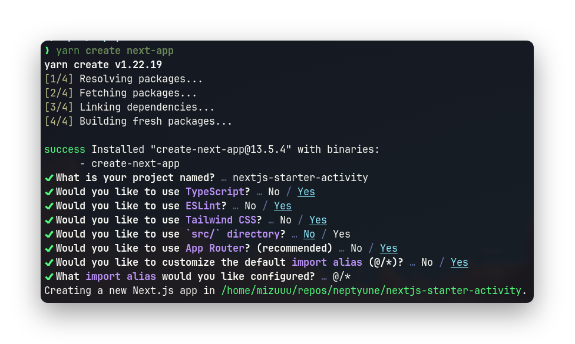

# README

## Creating the app

```bash 
yarn create next-app
```



- We want to use typescript - typescript > javascript.
- ESLINT - consistent linting for all of us.
- Tailwind CSS - easier atomic styling.
- Don't use src dir - we'll use the app dir.
- Let's use the app router.
- No need to customize the default import alias. (I chose yes by accident)

### Prettier

Let's add prettier as a dev dependency.

``` bash
yarn add -D prettier@2.8.8 eslint-config-prettier prettier-plugin-tailwindcss@3.3.2
```

Modify the `.eslintrc.json` so it contains this instead.

```json
{
  "extends": ["next/core-web-vitals", "prettier"]
}
```

Now create `.prettierrc.json` with following content.

``` json
{
  "trailingComma": "es5",
  "semi": true,
  "tabWidth": 2,
  "singleQuote": true,
  "jsxSingleQuote": true,
  "plugins": ["prettier-plugin-tailwindcss"]
}
```

Now to package.json also add this snippet in scripts. This allows us to run `yarn format` and format the project.

``` json
"scripts": {
  ...
  "format": "prettier --check --ignore-path .gitignore .",
  "format:fix": "prettier --write --ignore-path .gitignore ."
}
```

#### VSCode

Install `Prettier - Code formatter` extension.

Now setup for automatic code formatting.

Add this to your settings.json...?

```json
// Set the default
"editor.formatOnSave": false,
```

#### Neovim

Follow the guide on [prettier.nvim](https://github.com/MunifTanjim/prettier.nvim).

## Setting up Prisma and NextAuth

### Prisma
